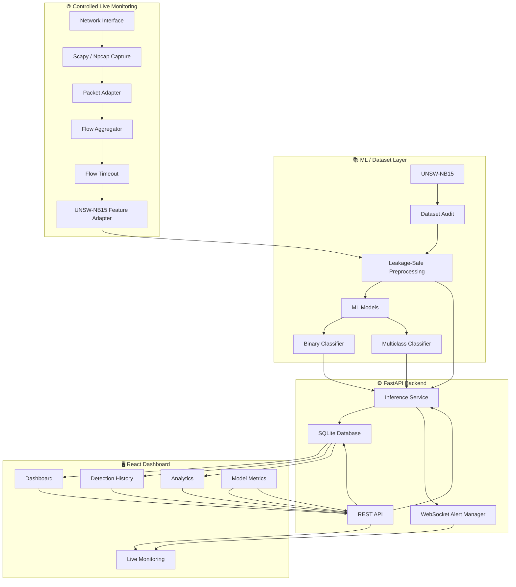

<div align="center">

# 🛡️ NIDS-ML

### Network Intrusion Detection System using Machine Learning

**UNSW-NB15 · XGBoost · FastAPI · React · SQLite · WebSockets · Scapy**

<br/>

**A machine-learning based network intrusion detection platform that classifies network traffic as Normal or Attack, identifies attack categories, stores detection history, provides real-time WebSocket alerts, and supports controlled live network-flow monitoring.**

<br/>

[](https://www.python.org/)
[](https://fastapi.tiangolo.com/)
[](https://react.dev/)
[](https://www.typescriptlang.org/)
[](https://xgboost.readthedocs.io/)
[](https://www.sqlite.org/)
[]()

<br/>

[GitHub Repository](https://github.com/santanu949/NIDS) · [Report Issue](https://github.com/santanu949/NIDS/issues)

</div>

---

## 📖 Overview

### The Problem

Modern network environments generate large volumes of traffic that are difficult to inspect manually. Intrusion Detection Systems must distinguish legitimate traffic from malicious activity while dealing with class imbalance, different attack types, false positives, and changing traffic patterns.

A model that reports 99% accuracy while generating excessive false positives is not particularly useful. The evaluation therefore considers precision, recall, F1-score, false-positive rate, confusion matrices, and per-class performance rather than accuracy alone.

### The Solution

**NIDS-ML** provides an end-to-end machine-learning intrusion detection pipeline built around the **UNSW-NB15** network intrusion dataset.

The system operates across two monitoring modes:

* **Dataset Mode** — evaluates structured UNSW-NB15 network-flow records using the trained ML pipeline.
* **Controlled Live Mode** — captures authorized network traffic using Scapy/Npcap, aggregates packets into flows, converts them into model-compatible features, and sends predictions to the backend.

The platform combines:

* Leakage-safe preprocessing
* Binary Normal/Attack detection
* Multiclass attack-category classification
* XGBoost inference
* FastAPI REST services
* SQLite persistence
* React dashboard
* WebSocket real-time alerts
* Detection analytics
* Controlled live packet capture
* Automated ML/API/WebSocket testing

---

## ✨ Key Features

### 🤖 Machine Learning Detection

| Feature                    | Description                                                               |
| :------------------------- | :------------------------------------------------------------------------ |
| **Binary Detection**       | Classifies network traffic as `Normal` or `Attack`                        |
| **Multiclass Detection**   | Identifies one of 10 UNSW-NB15 traffic categories                         |
| **Model Comparison**       | Logistic Regression, Random Forest, and XGBoost were evaluated            |
| **Primary Model**          | XGBoost selected using validation F1 score                                |
| **Confidence Scores**      | Binary and multiclass confidence values are returned for every prediction |
| **Leakage-Safe Pipeline**  | Preprocessing is fitted only on the training partition                    |
| **Feature Transformation** | 42 raw features become 192 transformed model features                     |

### 📊 Detection Dashboard

| Feature                | Description                                                              |
| :--------------------- | :----------------------------------------------------------------------- |
| **Dashboard Overview** | Traffic, attacks, normal events, threat rate, and severity statistics    |
| **Detection History**  | Searchable and filterable persisted predictions                          |
| **Detection Details**  | Detailed prediction, confidence, attack category, severity, and metadata |
| **Attack Analytics**   | Attack-category distribution and detection statistics                    |
| **Model Metrics**      | Validation and official test-set evaluation information                  |
| **Feature Importance** | Displays transformed XGBoost feature importance                          |
| **CSV Export**         | Export stored detections for further analysis                            |

### ⚡ Real-Time Monitoring

| Feature                 | Description                                                 |
| :---------------------- | :---------------------------------------------------------- |
| **Live Capture**        | Controlled packet capture using Scapy/Npcap                 |
| **Flow Aggregation**    | Packets are grouped into network flows before inference     |
| **Flow Timeout**        | Configurable timeout determines when flows are finalized    |
| **Live Prediction**     | Finalized flows are passed through the ML pipeline          |
| **WebSocket Alerts**    | New detections are broadcast to connected dashboard clients |
| **Start/Stop Controls** | Live monitoring can be safely started and stopped           |
| **Persistence**         | Live detections are stored alongside dataset detections     |

---

## 🏗️ System Architecture



### Data Flow

#### Dataset Prediction

```text
UNSW-NB15 Record
       │
       ▼
Feature Validation
       │
       ▼
Preprocessing
       │
       ├── Numeric → Median Imputation → StandardScaler
       │
       └── Categorical → Most-Frequent Imputation → OneHotEncoder
       │
       ▼
192 Transformed Features
       │
       ├───────────────┐
       ▼               ▼
Binary XGBoost    Multiclass XGBoost
       │               │
       ▼               ▼
Normal / Attack   Attack Category
       │               │
       └───────┬───────┘
               ▼
        Confidence + Severity
               │
               ▼
        SQLite Persistence
               │
        ┌──────┴──────┐
        ▼             ▼
      REST API    WebSocket Alert
        │             │
        └──────┬──────┘
               ▼
        React Dashboard
```

#### Live Monitoring

```text
Authorized Network Interface
            │
            ▼
      Scapy / Npcap
            │
            ▼
      Packet Adapter
            │
            ▼
      Flow Aggregator
            │
            ▼
       Flow Timeout
            │
            ▼
   UNSW-NB15 Feature Adapter
            │
            ▼
       ML Preprocessor
            │
            ▼
    Binary + Multiclass Model
            │
            ▼
       Prediction Event
            │
       ┌────┴─────┐
       ▼          ▼
    SQLite    WebSocket
       │          │
       └────┬─────┘
            ▼
      React Dashboard
```

---

## 🛠️ Tech Stack

| Layer                   | Technology         | Purpose                                                    |
| :---------------------- | :----------------- | :--------------------------------------------------------- |
| **Language**            | Python 3.12        | ML, backend, data processing                               |
| **Data Processing**     | pandas 3.0.5       | Dataset loading and transformation                         |
| **Numerical Computing** | NumPy 2.5.3        | Numerical operations                                       |
| **ML Framework**        | scikit-learn 1.9.1 | Preprocessing, Logistic Regression, Random Forest, metrics |
| **Primary ML Model**    | XGBoost 3.4.1      | Binary and multiclass classification                       |
| **Serialization**       | joblib 1.6.0       | Model and preprocessing artifact storage                   |
| **Backend Framework**   | FastAPI 0.141.1    | REST inference API                                         |
| **Server**              | Uvicorn 0.53.0     | ASGI application server                                    |
| **Validation**          | Pydantic 2.13.5    | API request/response validation                            |
| **Database ORM**        | SQLAlchemy 2.0.43  | Database persistence layer                                 |
| **Database**            | SQLite             | Local prediction history                                   |
| **Live Capture**        | Scapy 2.7.0        | Network packet capture and processing                      |
| **Windows Capture**     | Npcap              | Packet capture driver                                      |
| **WebSocket**           | websockets 17.1    | Automated WebSocket testing                                |
| **Frontend**            | React + TypeScript | Dashboard UI                                               |
| **Build Tool**          | Vite 8.3.0         | Frontend development and production builds                 |
| **Version Control**     | Git                | Source control and project history                         |

---

## 📊 Dataset & Machine Learning

### Dataset

The primary dataset is **UNSW-NB15**.

The implemented model excludes:

* `id` as an identifier
* `label` as the binary target
* `attack_cat` as the multiclass target

The resulting input contains:

* **42 raw model features**
* **39 numeric features**
* **3 categorical features**

Categorical features:

```text
proto
service
state
```

The preprocessing pipeline transforms these into:

```text
192 model-ready features
```

### Dataset Split

| Dataset Partition |    Rows | Purpose                                |
| :---------------- | ------: | :------------------------------------- |
| Training          | 140,272 | Model training + preprocessing fitting |
| Validation        |  35,069 | Model comparison and selection         |
| Official Test     |  82,332 | Final held-out evaluation              |

The training data is split using stratification with:

```text
random_state = 42
```

The preprocessing pipeline is fitted **only on the training partition**.

The official test set remains untouched during model selection.

### Data Quality Audit

The supplied dataset was audited before preprocessing.

| Check          | Training | Testing |
| :------------- | -------: | ------: |
| Missing Values |        0 |       0 |
| Duplicate Rows |        0 |       0 |
| Rows           |  175,341 |  82,332 |
| Columns        |       45 |      45 |

---

## 🔒 Leakage-Safe Preprocessing

The preprocessing pipeline follows:

```text
Raw Dataset
     │
     ▼
Data Audit
     │
     ▼
Remove id / label / attack_cat
     │
     ▼
Stratified Train / Validation Split
     │
     ▼
Fit Preprocessor ONLY on Training Data
     │
     ├── Numeric
     │      ├── Median Imputation
     │      └── StandardScaler
     │
     └── Categorical
            ├── Most-Frequent Imputation
            └── OneHotEncoder
                    │
                    ▼
             192 Features
```

This prevents validation or official test information from being used to calculate preprocessing parameters.

The preprocessor is serialized as:

```text
backend/ml/artifacts/preprocessor.joblib
```

---

## 🤖 Model Training

Three binary classification approaches were compared:

1. Logistic Regression
2. Random Forest
3. XGBoost

The selection metric was **validation F1 score**.

### Binary Validation Results

| Model               | Accuracy | Precision |   Recall |           F1 | False Positive Rate |
| :------------------ | -------: | --------: | -------: | -----------: | ------------------: |
| Logistic Regression | 0.932533 |  0.949948 | 0.950982 |     0.950465 |            0.106786 |
| Random Forest       | 0.957170 |  0.973656 | 0.963132 |     0.968366 |            0.055536 |
| XGBoost             | 0.962132 |  0.967094 | 0.977628 | **0.972332** |            0.070893 |

XGBoost was selected as the primary binary inference model based on the highest validation F1 score among the compared models.

### Binary Model

```text
XGBoost
├── n_estimators: 300
├── learning_rate: 0.10
├── max_depth: 8
├── subsample: 0.80
├── colsample_bytree: 0.80
├── objective: binary:logistic
├── tree_method: hist
└── random_state: 42
```

---

## 🎯 Multiclass Detection

The multiclass classifier predicts ten UNSW-NB15 categories:

```text
Analysis
Backdoor
DoS
Exploits
Fuzzers
Generic
Normal
Reconnaissance
Shellcode
Worms
```

### Multiclass Validation Results

| Metric             |    Score |
| :----------------- | -------: |
| Accuracy           | 0.833984 |
| Weighted Precision | 0.831544 |
| Weighted Recall    | 0.833984 |
| Weighted F1        | 0.820354 |
| Macro F1           | 0.618551 |

The gap between weighted F1 and macro F1 reflects the substantial class imbalance in the dataset, particularly among rare attack categories.

The system therefore exposes per-class metrics rather than relying exclusively on overall accuracy.

---

## 🧪 Official Test Evaluation

The official UNSW-NB15 test set contains **82,332 rows** and was not used during model selection.

It was evaluated only after the model and preprocessing pipeline had been finalized.

### Binary Official Test Results

| Metric              |   Result |
| :------------------ | -------: |
| Accuracy            | 0.871496 |
| Precision           | 0.820437 |
| Recall              | 0.981404 |
| F1                  | 0.893730 |
| False Positive Rate | 0.263162 |

Confusion matrix:

```text
                 Predicted
                 Normal   Attack

Actual Normal     27263     9737
Actual Attack       843    44489
```

### Multiclass Official Test Results

| Metric             |   Result |
| :----------------- | -------: |
| Accuracy           | 0.765595 |
| Weighted Precision | 0.835789 |
| Weighted Recall    | 0.765595 |
| Weighted F1        | 0.779305 |
| Macro F1           | 0.513651 |

The lower macro F1 indicates significantly weaker performance on several rare attack classes compared with the dominant categories.

This is an important limitation of the current model and is intentionally exposed rather than hidden behind the overall accuracy number.

---

## 🧠 Model Feature Importance

The trained binary XGBoost model exposes transformed feature importance through the backend API and React dashboard.

Important transformed features include:

```text
sttl
ct_state_ttl
dttl
proto_tcp
proto_unas
service_dns
state_CON
proto_rvd
ct_dst_sport_ltm
proto_cbt
```

Feature importance is calculated from the trained XGBoost model using the transformed feature names generated by the preprocessing pipeline.

---

## ⚙️ Backend API

The FastAPI backend exposes the following services.

### Health

```text
GET /health
```

Returns API health information.

### Dashboard Summary

```text
GET /api/dashboard/summary
```

Returns aggregate detection statistics and recent events.

### Prediction

```text
POST /api/predict
```

Runs binary and multiclass inference and persists the resulting prediction event.

Request structure:

```json
{
  "mode": "dataset",
  "features": {
    "...": "complete UNSW-NB15 feature set"
  }
}
```

The complete feature schema is required for inference.

### Batch Prediction

```text
POST /api/predict/batch
```

Runs multiple predictions in one request.

### Detection History

```text
GET /api/detections
```

Returns persisted detection events with pagination and filtering support.

### Detection Detail

```text
GET /api/detections/{id}
```

Returns an individual detection event.

### Detection Export

```text
GET /api/detections/export.csv
```

Exports persisted detections as CSV.

### Attack Analytics

```text
GET /api/analytics/attacks
```

Returns attack-category statistics.

### Model Metrics

```text
GET /api/model/metrics
```

Returns model evaluation information.

### Model Features

```text
GET /api/model/features
```

Returns transformed feature importance information.

### Live Status

```text
GET /live/status
```

Returns current live-monitoring status and configuration.

### Start Live Monitoring

```text
POST /live/start
```

Starts controlled packet capture using the configured network interface.

### Stop Live Monitoring

```text
POST /live/stop
```

Stops live packet capture safely.

### WebSocket Alerts

```text
WS /ws/alerts
```

Connected dashboard clients receive newly generated prediction events through WebSocket broadcasts.

---

## 🗄️ Database

NIDS-ML uses SQLite for local prediction persistence.

The primary prediction-event record contains:

```text
id
timestamp
mode
source_ip
destination_ip
protocol
binary_prediction
binary_label
binary_confidence
attack_category
multiclass_confidence
severity
model_version
```

The database allows the frontend to display historical detections rather than relying on temporary in-memory statistics.

---

## 🌐 Live Monitoring

NIDS-ML supports controlled live network monitoring using:

```text
Scapy
Npcap
Network Interface
Flow Aggregation
UNSW-NB15 Feature Adapter
XGBoost
```

The live monitoring pipeline is:

```text
Network Interface
       │
       ▼
Scapy / Npcap
       │
       ▼
Packet Adapter
       │
       ▼
Flow Aggregator
       │
       ▼
Flow Timeout
       │
       ▼
Feature Adapter
       │
       ▼
Preprocessor
       │
       ▼
Binary + Multiclass XGBoost
       │
       ▼
Prediction Event
       │
       ├── SQLite
       │
       └── WebSocket
              │
              ▼
       React Dashboard
```

### Live Configuration

The live interface and timeout are configured through `.env`:

```env
NIDS_LIVE_INTERFACE=YOUR_NETWORK_INTERFACE
NIDS_LIVE_FLOW_TIMEOUT=5
```

The interface value must correspond to a valid Scapy/Npcap interface on the machine.

### Live Feature Limitations

UNSW-NB15 contains features that depend on flow context and application-layer information.

Some values cannot be reconstructed exactly from arbitrary captured packets and are therefore approximated or tracked using short-term context.

Examples include:

```text
sloss
dloss
trans_depth
response_body_len
is_ftp_login
ct_ftp_cmd
ct_flw_http_mthd
```

Several `ct_*` contextual features are also maintained using short-term live-flow tracking.

Therefore, live-mode predictions should **not** be interpreted as mathematically identical to offline predictions on native UNSW-NB15 records.

Live monitoring is intended as a controlled demonstration and monitoring pipeline rather than a claim of perfect reproduction of every UNSW-NB15 feature semantic.

---

## 🚨 Severity System

Predictions are assigned a severity level for dashboard presentation and triage.

Severity incorporates prediction information such as:

* Binary classification
* Attack category
* Model confidence

Severity is a presentation and prioritization signal.

It is **not** an automated response mechanism and does not trigger network blocking.

---

## 🖥️ Frontend Dashboard

The React dashboard provides:

* System/API status
* WebSocket connection status
* Dashboard summary
* Total detection count
* Malicious detection count
* Normal traffic count
* Threat rate
* High-severity detection count
* Recent detections
* Detection search
* Detection filtering
* Detection details
* Attack-category analytics
* Model evaluation metrics
* Feature importance
* Live capture controls
* Live detection updates
* WebSocket alerts
* CSV detection export
* System configuration information
* Loading states
* API error handling

The frontend retrieves data from the FastAPI backend rather than displaying hard-coded detection statistics.

---

## ⚙️ Setup & Installation

### Prerequisites

Recommended environment:

* **Python 3.12.x**
* **Node.js 24.x**
* **npm 11.x**
* **Git**

For live packet monitoring on Windows:

* **Npcap**
* A supported network interface
* Appropriate permissions for packet capture

Dataset-only inference does not require live packet capture.

### 1. Clone the Repository

```bash
git clone https://github.com/santanu949/NIDS.git
cd NIDS
```

### 2. Create the Python Environment

Windows PowerShell:

```powershell
python -m venv .venv
```

Activate it:

```powershell
.\.venv\Scripts\Activate.ps1
```

### 3. Install Backend Dependencies

```powershell
pip install -r backend\requirements.txt
```

### 4. Configure Environment Variables

Copy:

```text
.env.example
```

to:

```text
.env
```

Configure the live interface if live monitoring is required:

```env
NIDS_LIVE_INTERFACE=YOUR_NETWORK_INTERFACE
NIDS_LIVE_FLOW_TIMEOUT=5
```

For dataset-only usage, the live interface does not need to be configured.

### 5. Start the Backend

From the project root:

```powershell
.\.venv\Scripts\python.exe -m uvicorn backend.api.main:app --reload --port 8000
```

FastAPI will be available at:

```text
http://127.0.0.1:8000
```

Interactive API documentation:

```text
http://127.0.0.1:8000/docs
```

### 6. Install Frontend Dependencies

Open a second terminal:

```powershell
cd frontend
npm install
```

### 7. Start the Frontend

```powershell
npm run dev
```

The Vite development server normally runs at:

```text
http://localhost:5173
```

### 8. Build the Frontend

For a production frontend build:

```powershell
npm run build
```

The generated production assets are placed in:

```text
frontend/dist/
```

---

## 📖 Usage Guide

### Dataset Prediction

1. Start the FastAPI backend.
2. Start the React frontend.
3. Open the dashboard.
4. Submit a valid UNSW-NB15 feature record.
5. The backend validates the request.
6. The preprocessing artifact transforms the input.
7. Binary XGBoost predicts Normal/Attack.
8. Multiclass XGBoost predicts the attack category.
9. Confidence and severity are calculated.
10. The prediction is stored in SQLite.
11. The dashboard displays the resulting detection.

### Detection History

The Detections section provides access to stored prediction events.

Users can:

* Search detections
* Filter results
* Inspect individual events
* Review confidence values
* Review attack categories
* Review severity
* Export detection history as CSV

### Analytics

The Analytics section exposes aggregate attack-category information based on persisted prediction events.

### Model

The Model section provides:

* Model-selection information
* Binary model metrics
* Multiclass metrics
* Official test-set evaluation availability
* Feature importance
* Dataset information
* Transformed feature count

### Live Monitoring

1. Configure a valid Npcap interface.
2. Start the FastAPI backend.
3. Open the React dashboard.
4. Start live monitoring.
5. Scapy captures authorized traffic.
6. Packets are aggregated into flows.
7. Finalized flows are converted into model-compatible features.
8. The ML pipeline generates predictions.
9. Results are stored in SQLite.
10. WebSocket alerts update connected dashboards.
11. Stop monitoring when finished.

Live capture should only be performed on networks and systems for which the operator has authorization.

---

## 📁 Project Structure

```text
NIDS/
│
├── backend/
│   │
│   ├── api/
│   │   ├── inference.py
│   │   ├── main.py
│   │   ├── schemas.py
│   │   └── websocket.py
│   │
│   ├── app/
│   │   ├── config.py
│   │   ├── database.py
│   │   └── models/
│   │       └── prediction_event.py
│   │
│   ├── data/
│   │   ├── raw/
│   │   │   ├── UNSW_NB15_training-set.csv
│   │   │   └── UNSW_NB15_testing-set.csv
│   │   ├── audit_report.json
│   │   ├── audit_report.txt
│   │   └── feature_schema.json
│   │
│   ├── live/
│   │   ├── capture.py
│   │   ├── context_tracker.py
│   │   ├── flow_adapter.py
│   │   ├── flow_aggregator.py
│   │   ├── flow_manager.py
│   │   ├── packet_adapter.py
│   │   ├── predict_live.py
│   │   └── service.py
│   │
│   ├── ml/
│   │   ├── artifacts/
│   │   ├── audit.py
│   │   ├── evaluate_official_test.py
│   │   ├── preprocess.py
│   │   └── validate.py
│   │
│   └── requirements.txt
│
├── docs/
│   ├── data-preprocessing.md
│   └── phase2_report.md
│
├── frontend/
│   ├── src/
│   │   ├── App.tsx
│   │   ├── api.ts
│   │   └── ...
│   ├── package.json
│   └── vite.config.ts
│
├── tests/
│   ├── test_api.py
│   ├── test_ml_pipeline.py
│   └── test_websocket.py
│
├── .env.example
├── .gitignore
└── README.md
```

---

## 🧪 Testing

The project includes automated tests covering the ML pipeline, API, and WebSocket functionality.

### ML Pipeline Tests

```text
7/7 passed
```

Coverage includes preprocessing/model artifact behavior and ML pipeline validation.

### API Tests

```text
13/13 passed
```

Coverage includes:

* Health endpoint
* Prediction contract
* Batch prediction
* Detection persistence
* Detection listing
* Dashboard summary
* Analytics
* Model metrics
* Feature importance
* Live status/control behavior
* Validation/error handling

### WebSocket Tests

```text
1/1 passed
```

The test verifies that a prediction event is broadcast to a connected WebSocket client.

### Full Test Suite

```text
21/21 passed
```

Full discovery command:

```powershell
.\.venv\Scripts\python.exe -m unittest discover -s tests -p "test_*.py" -v
```

---

## 🔐 Security & Ethical Considerations

NIDS-ML is intended for defensive security research, education, and controlled network monitoring.

### Authorized Monitoring

Live packet capture should only be performed on systems and networks where the operator has explicit authorization.

### No Automated Blocking

The current implementation does not automatically:

* Block IP addresses
* Terminate connections
* Modify firewall rules
* Launch countermeasures

The system is detection and monitoring focused.

### Controlled Attack Testing

Attack traffic used for demonstrations should be generated only inside an authorized and isolated environment.

### Sensitive Information

The project should avoid storing unnecessary packet payloads, credentials, secrets, or other sensitive information in logs.

Flow metadata should be preferred wherever possible.

---

## ⚠️ Limitations

The current system has several important limitations.

### Dataset Limitations

UNSW-NB15 is a benchmark dataset and does not represent every modern network environment.

Real-world traffic distributions may differ significantly from the training and testing distributions.

### Class Imbalance

Rare attack categories have substantially fewer examples than dominant categories.

This contributes to the lower macro F1 score observed during multiclass evaluation.

### Live Feature Approximation

Some UNSW-NB15 features cannot be reproduced exactly from arbitrary live packet captures.

The live adapter therefore uses approximations and short-term context tracking for selected fields.

### Model Confidence

A confidence value produced by the classifier should not be interpreted as a calibrated real-world probability that traffic is malicious.

### No Automated Response

The system currently detects and records threats but does not automatically block or remediate them.

### Capture Environment

Live monitoring depends on:

* Operating system support
* Npcap
* Scapy
* Network-interface compatibility
* Appropriate permissions

---

## 📚 Documentation

Additional technical documentation is maintained under:

```text
docs/
```

Current documentation includes:

* Data preprocessing methodology
* Phase 2 validation and reporting
* Dataset audit information
* Model evaluation artifacts
* Official test-set evaluation results

The repository also contains serialized model/preprocessing artifacts required by the inference pipeline where included by the project distribution.

---

## 🔄 Development Workflow

The project was implemented through the following major phases:

| Phase | Description                        | Status     |
| :---- | :--------------------------------- | :--------- |
| 1     | Environment + Repository           | ✅ Complete |
| 2     | Dataset Acquisition + Data Audit   | ✅ Complete |
| 3     | Leakage-Safe Preprocessing         | ✅ Complete |
| 4     | Train + Compare ML Models          | ✅ Complete |
| 5     | Binary + Multiclass Detection      | ✅ Complete |
| 6     | FastAPI Inference API              | ✅ Complete |
| 7     | Database Persistence               | ✅ Complete |
| 8     | React Dashboard                    | ✅ Complete |
| 9     | Live Monitoring + Alerts           | ✅ Complete |
| 10    | Testing + Security + Documentation | ✅ Complete |

---

## 📈 Current Status

| Module                     | Status           |
| :------------------------- | :--------------- |
| UNSW-NB15 Dataset Audit    | 🟢 Complete      |
| Leakage-Safe Preprocessing | 🟢 Complete      |
| Binary Classification      | 🟢 Complete      |
| Multiclass Classification  | 🟢 Complete      |
| XGBoost Inference          | 🟢 Complete      |
| FastAPI Backend            | 🟢 Complete      |
| SQLite Persistence         | 🟢 Complete      |
| React Dashboard            | 🟢 Complete      |
| Detection History          | 🟢 Complete      |
| Analytics                  | 🟢 Complete      |
| WebSocket Alerts           | 🟢 Complete      |
| Controlled Live Monitoring | 🟢 Complete      |
| Automated Tests            | 🟢 21/21 Passing |
| Production Frontend Build  | 🟢 Passing       |
| Official Test Evaluation   | 🟢 Complete      |
| Documentation              | 🟢 Complete      |

---

## 👤 Contributor

<div align="center">

<a href="https://github.com/santanu949">
  
  <br />
  <sub><b>Santanu Samanta</b></sub>
</a>

<br/>

Creator & Lead Developer

</div>

---

<div align="center">

<br/>

**NIDS-ML**

*Machine Learning for Network Intrusion Detection*

<br/>

<sub>Built for defensive security research, education, and controlled network monitoring.</sub>

</div>
